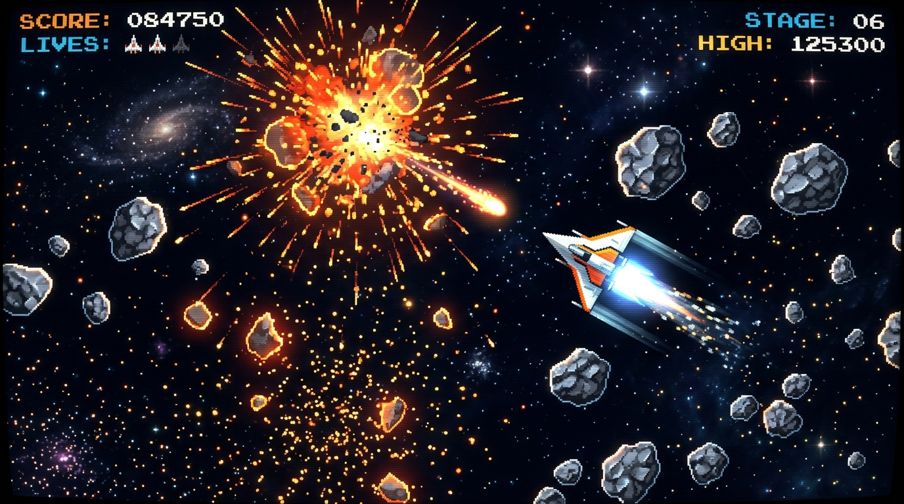
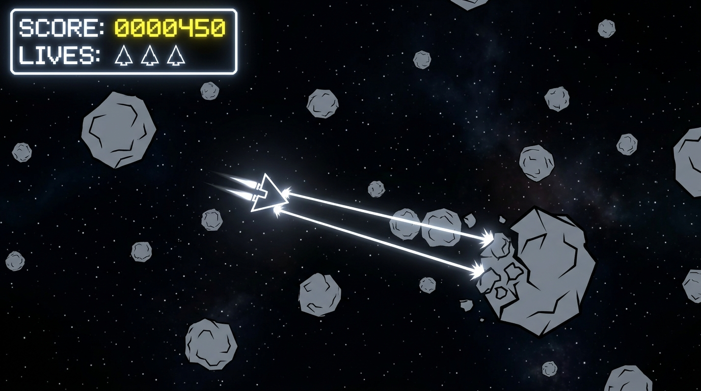
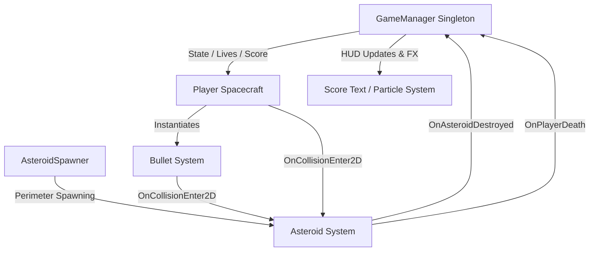

# Asteroids 2D

[](https://unity.com/)
[](https://docs.microsoft.com/dotnet/csharp/)
[](LICENSE)
[](.github/workflows/ci.yml)

> A modern, production-grade 2D recreation of the classic 1979 Atari arcade game *Asteroids*, engineered in Unity 2023 and C# with zero-gravity inertial physics, toroidal screen topology, and dynamic procedural object splitting.

---

## 📷 Gameplay Preview

| Demonstration | Visual Showcase |
| :--- | :--- |
| **Inertial Spacecraft & Laser Firing** |  |
| **Asteroid Fracturing & Score HUD** |  |

*(High-resolution visual assets and recordings are located in the [`docs/assets/`](docs/assets/) directory.)*

---

## 💡 Overview & Motivation

**Asteroids 2D** is an open-source arcade game built to demonstrate clean Unity software engineering, object lifecycle management, and physics-driven 2D gameplay programming.

Key technical highlights include:
* **Vector Mechanics & Inertia:** Real-time physics simulation using linear forces (`AddForce`) and rotational torque (`AddTorque`) without manual kinematic solvers.
* **Toroidal Space Topology:** Dynamic world-space camera boundary calculation enabling continuous screen wrapping across all four edges.
* **Procedural Object Fracturing:** Dynamic multi-stage splitting of parent game objects into child entities with randomized unit vector impulse trajectories.
* **Event-Driven Lifecycle:** Singleton state controller (`GameManager`) maintaining score scaling, player lives, spawn invulnerability layers, and Game Over states.

---

## ✨ Features

* **Physics-Driven Spacecraft Control:** Zero-gravity acceleration and steering torque powered by Unity's 2D Rigid-body physics engine.
* **Toroidal Screen Boundary Wrapping:** Teleports entities exceeding screen edges to opposing perimeters while preserving linear and angular momentum.
* **Procedural Asteroid Fracturing:** Shot asteroids split into two smaller sub-asteroids down to a configurable minimum size threshold (`0.35f`).
* **Perimeter Spawner System:** Spawns primary asteroids along a calculated radial distance around screen origin with angular trajectory variance.
* **Weapon Cooldown Controller:** Fire-rate timer preventing frame-based input spam while enforcing automatic bullet lifecycle cleanup.
* **Post-Respawn Invulnerability:** Layer-based collision matrix toggle protecting the spacecraft upon respawn.
* **Arcade Score Engine:** Dynamic score rewards based on asteroid scale tier (+100 for small, +50 for medium, +25 for large).

---

## 🛠️ Tech Stack

| Domain | Technology / Module | Purpose |
| :--- | :--- | :--- |
| **Game Engine** | Unity `2023.1.20f1` | Core runtime engine & 2D rendering pipeline |
| **Programming Language** | C# 10.0 / .NET Mono | Gameplay logic, state machines, and system scripts |
| **Physics Engine** | Unity 2D Physics (`Physics2D`) | Rigidbodies, colliders, and collision layer matrix |
| **UI System** | Unity UI (`UnityEngine.UI`) | Real-time score counter, lives HUD, and overlay screens |
| **FX & Audio** | Particle System (`ParticleSystem`) | Particle explosion burst effects on destruction |

---

## 📐 Architecture Overview



### Documentation Index
* 📖 **[Setup & Installation Guide](docs/setup.md):** Environment requirements, Unity Hub setup, and project importing.
* 🎮 **[Usage & Controls Guide](docs/usage.md):** Key bindings, gameplay rules, and scoring tiers.
* 🏗️ **[Architecture Overview](docs/architecture.md):** Detailed breakdown of systems, event flows, and state machines.
* 💻 **[Development & Build Guide](docs/development.md):** Command-line builds, C# coding standards, and project configuration.
* 📋 **[API Reference](docs/api.md):** C# class and method specifications.
* ⚖️ **[Architecture Decision Records](docs/decisions.md):** Trade-offs and design rationale (ADRs).
* 🧪 **[Testing & Quality Assurance](docs/testing.md):** Verification protocols and automated checks.

---

## ⚙️ Quick Start

```bash
# Clone the repository
git clone https://github.com/sedmugen/asteroids.git

# Navigate into project directory
cd asteroids
```

1. Open **Unity Hub** and select **Add project from disk**.
2. Select the `asteroids` directory (Unity `2023.1.20f1` required).
3. Open `Assets/Scenes/Asteroids.unity` and click **Play**.

---

## 🎮 Controls

| Action | Primary Input | Secondary Input |
| :--- | :--- | :--- |
| **Forward Thrust** | `W` | `Up Arrow` |
| **Rotate Left** | `A` | `Left Arrow` |
| **Rotate Right** | `D` | `Right Arrow` |
| **Fire Laser** | `Space` | `Left Mouse Click` |
| **Restart Game** | `Enter / Return` | — |

---

## 🗺️ Roadmap

- [x] Zero-gravity physics flight and torque steering
- [x] Toroidal screen boundary wrapping
- [x] Procedural asteroid perimeter spawner and fracturing
- [x] State manager for lives, score, and game over sequence
- [ ] Refactor UI layer to TextMeshPro (`TMPro.TextMeshProUGUI`)
- [ ] Generic `ObjectPool<T>` for high-frequency `Bullet` and `Asteroid` entities
- [ ] Sound effect engine (laser fire, thrust hum, explosions, background audio track)
- [ ] Gamepad integration via Unity Input System (`com.unity.inputsystem`)

---

## 📄 License

Distributed under the MIT License. See [`LICENSE`](LICENSE) for complete license text.
