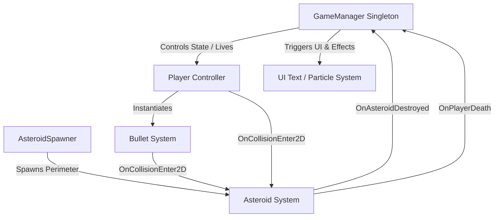

# Architecture Overview

This document details the system design, object interaction flow, physics engine usage, and game state lifecycle of the **Asteroids** project.

---

## System Context & Component Interaction

The architecture follows a component-driven structure centered around Unity's `MonoBehaviour` lifecycle and a single persistent `GameManager`.



---

## Key Systems

### 1. Game State Manager (`GameManager.cs`)
* **Pattern:** Singleton with `DontDestroyOnLoad`.
* **Responsibilities:**
  * Initializing score (`0`) and player lives (`3`).
  * Respawning the player ship at origin `(0, 0, 0)`.
  * Handling asteroid destruction events, calculating score increments based on size tier (Small: 100, Medium: 50, Large: 25).
  * Managing Game Over state and handling Enter key restarts.

### 2. Player Spacecraft (`Player.cs`)
* **Movement Dynamics:** Uses `Rigidbody2D.AddForce` for forward linear thrust and `Rigidbody2D.AddTorque` for rotational steering.
* **Screen Wrapping Algorithm:**
  ```csharp
  screenBounds = new Bounds();
  screenBounds.Encapsulate(Camera.main.ScreenToWorldPoint(Vector3.zero));
  screenBounds.Encapsulate(Camera.main.ScreenToWorldPoint(new Vector3(Screen.width, Screen.height, 0f)));
  ```
  If player position exceeds `screenBounds.max` or drops below `screenBounds.min`, position is inverted to the opposite edge without modifying linear or angular velocity.
* **Invulnerability Layer System:**
  Upon respawn, player layer is temporarily switched to `"Ignore Collisions"` for `3` seconds before reverting to `"Player"`.

### 3. Procedural Asteroid Engine (`Asteroid.cs` & `AsteroidSpawner.cs`)
* **Spawning:** `AsteroidSpawner` calculates points on a circle radius around screen origin, introducing angular variance before instantiating `Asteroid.prefab`.
* **Splitting Dynamics:** When a bullet collides with an asteroid whose scale is above `minSize` (`0.35f`), two new sub-asteroids are created at half scale (`size * 0.5f`) with randomized unit vector trajectories.

---

## Memory & Performance Management

* Short-lived game objects (`Bullet`, `Asteroid`) rely on Unity `Instantiate` and `Destroy(gameObject, maxLifetime)`.
* Future roadmap item includes migrating high-frequency entities to a pre-allocated `ObjectPool<T>`.
